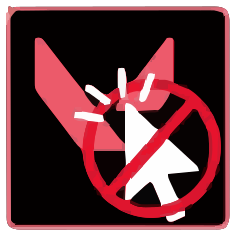

     
    
    <h1>VAIL</h1>
    
The <b>V</b>ALORANT <b>A</b>nti <b>I</b>nsta<b>L</b>ock Project

## Repository contents

#### [Webserver](https://github.com/SuppliedOrange/VAIL/tree/main/webserver)

The main backend server for handling website/app requests, processing game data, and handling crypto operations.

#### [Website](https://github.com/SuppliedOrange/VAIL/tree/main/website)

The frontend website, offering registration and a concise view of the player's match analysis history. The website also stands a central location for information about this project and the application. 

#### [Application (pregame_checker)](https://github.com/SuppliedOrange/VAIL/tree/main/pregame_checker)

The actual application that sits on the user's computer to monitor and analyze their VALORANT games. Sits in the tray menu and can be disabled/enabled at will.